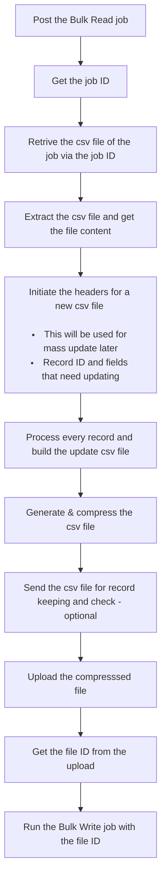

# Zoho-CRM-bulk-APIs-for-Mass-Update
Zoho CRM's Bulk API allows us to get, process and update records in a more scalable way without burning a ton of API credits. 

## Problem Statement
We need to process and update tens of thousands of records in CRM. Using CRM's API or Deluge task works fine if you have a small dataset, but it becomes unscalable for a larger set of data (the more the records, the higher the API usage).

## Solution
[Zoho CRM Bulk API](https://www.zoho.com/crm/developer/docs/api/v3/bulk-read/overview.html) allows us to get and update a large set of data in a single API call each, up to 250,000 records per call! We will be using the [Bulk Read API](https://www.zoho.com/crm/developer/docs/api/v3/bulk-read/overview.html) to get the records, and then [Bulk Write API](https://www.zoho.com/crm/developer/docs/api/v3/bulk-write/overview.html) to update.

Here's a summary of what the script would look like:



## Configuration

### Scopes Needed
- ZohoCRM.bulk.read
- ZohoCRM.bulk.ALL
- ZohoCRM.bulk.CREATE
- ZohoFiles.files.ALL
- ZohoCRM.modules.ALL

### Standalone Functions Needed
Create some standalone functions to be called in the main script.
> **Tip:**  You can call another standalone function from a function in Zoho Deluge by using standalone.<function_name>(parameters if any)


#### delay
Zoho Deluge does not have a native delay function, so we write our own (with some help of an external API). This function used to create a short delay in the main script between posting the bulk read job and retrieving the job content because Zoho takes some time to index the job).
```javascript
sleep = invokeurl
[
	url :"https://httpstat.us/200?sleep=" + waitTimeInSeconds * 1000
	type :GET
	detailed:true
];
return sleep;
````
_Note: Set waitTimeinSeconds as the function parameter (int)_

#### getOrgId
This is basically to get the org ID of your CRM account. If you wish to save 1 API call, you can just hard-code the org ID in the main script and skip this.
```javascript
orgInfo = invokeurl
[
	url :"https://www.zohoapis.com/crm/v2/org"
	type :GET
	connection:"crm"
];
orgId = orgInfo.get("org").get(0).get("zgid");
return orgId;
```

## Script Tutorial

